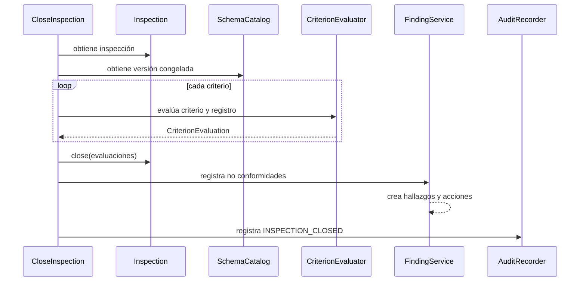
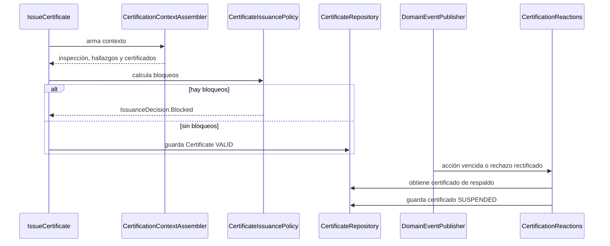

# Decisiones de diseño

## 1. Propósito y alcance

Este repositorio implementa el módulo de dominio de una plataforma de inspección,
habilitación y certificación de activos técnicos. El alcance corresponde a la Entrega 1
de la consigna: modelos de negocio, reglas, casos de uso, contratos y tests.

No se implementan en esta entrega API REST, frontend, persistencia real, seguridad ni
despliegue. Los repositorios en memoria que aparecen en `src/test` son adaptadores de
prueba para ejercitar el dominio completo, no una decisión de persistencia de producción.

La implementación usa Java 25 y no tiene dependencias de producción sobre frameworks,
contenedores o bibliotecas de persistencia. Las dependencias del `pom.xml` se limitan a
las herramientas de testing.

## 2. Principios y arquitectura

### Puertos y adaptadores

Se aplica una arquitectura de puertos y adaptadores. Los casos de uso dependen de
interfaces ubicadas en los paquetes `application/**/port`, por ejemplo:

- `AssetRepository`, `PartyRepository` y `AssetDirectory` para el catálogo.
- `SchemaRepository` y `SchemaCatalog` para esquemas.
- `InspectionRepository`, `InspectionQuery` y `FindingRegistry` para inspecciones.
- `FindingRepository` y `FindingQuery` para hallazgos.
- `CertificateRepository` para certificados.
- `Clock`, `IdGenerator`, `ActorProvider`, `DomainEventPublisher` y `AuditTrail` para servicios externos.

La razón es que las reglas del negocio no deben conocer cómo se guardan datos, cómo se
generan identificadores o cómo se obtiene la hora. En producción esas interfaces podrían
tener adaptadores de base de datos, web o mensajería sin modificar el dominio.

En los tests, `FullSystem` funciona como composition root y conecta los casos de uso con
`InMemoryCatalogue`, `InMemorySchemaRepository`, `InMemoryInspectionRepository`,
`InMemoryFindingRepository`, `InMemoryCertificateRepository`, `TestClock` y los demás
adaptadores de prueba.

### Separación entre dominio y aplicación

El paquete `domain` contiene entidades, objetos de valor, reglas, políticas y eventos.
El paquete `application` contiene casos de uso y servicios que coordinan repositorios,
dominio, auditoría y eventos.

Un caso de uso no duplica reglas internas de una entidad. Por ejemplo, `CloseInspection`
coordina la carga de la inspección y el evaluador, pero `Inspection` es quien controla
sus estados y `Certificate` es quien controla suspensión, reactivación y vencimiento.

### Agregados y encapsulamiento

Los agregados principales son `InspectionSchema`, `Asset`, `Inspection`, `Finding` y
`Certificate`. Cada uno protege sus invariantes y expone operaciones de negocio en lugar
de permitir modificaciones arbitrarias de sus colecciones internas.

Las listas, mapas y conjuntos expuestos se devuelven como copias inmutables. Los
identificadores son objetos de valor (`AssetId`, `InspectionId`, `CriterionId`, etc.) y
las relaciones entre agregados se conservan principalmente por identificador para evitar
que un agregado modifique accidentalmente el estado de otro.

## 3. Modelo de dominio

### Catálogo de activos

`Asset` representa el activo inspeccionable y contiene:

- identificador estable y nombre;
- `AssetType` (`LABORATORY`, `FACTORY`, `FACILITY`, `EQUIPMENT`);
- responsable (`ResponsiblePartyRef`);
- ubicación;
- características.

`Party` representa personas u organizaciones. El catálogo permite registrar y consultar
activos, cambiar responsable y relocalizar. Esos cambios producen información de auditoría.

Al iniciar una inspección se captura un `AssetSnapshot`. Así, una inspección conserva el
tipo, nombre, ubicación, características y responsable que existían en ese momento,
aunque el activo cambie después.

Casos de uso principales: `RegisterParty`, `RegisterAsset`, `SearchAssets`,
`RelocateAsset` y `ChangeAssetResponsible`.

### Esquemas, secciones y criterios

`InspectionSchema` es el agregado raíz de un esquema. Puede aplicarse a uno o varios tipos
de activo y conserva sus versiones publicadas. El contenido se modifica mediante un único
`SchemaDraft` abierto y luego se publica como `SchemaVersion` inmutable.

La estructura es:

```text
InspectionSchema
    -> SchemaDraft o SchemaVersion
             -> Section
                        -> Criterion
                                 -> EvaluationRule
                                 -> EvidenceRequirement
```

Un `Criterion` tiene una regla de evaluación y requisitos de evidencia. Las reglas
implementadas son:

- `NumericRangeRule`, para mediciones con unidad, límites y bandas.
- `YesNoRule`, para respuestas afirmativas o negativas.
- `MappedOptionsRule`, para opciones con resultados asociados.

Cada regla produce exactamente uno de estos resultados:

- `APPROVED`: el criterio cumple.
- `OBSERVED`: hay una desviación que requiere corrección, pero no bloquea por sí sola la certificación.
- `REJECTED`: existe un incumplimiento que bloquea hasta su corrección y verificación.

Antes de publicar, el draft valida las reglas. Las reglas numéricas deben cubrir sin
ambigüedades el dominio admitido, sin superposiciones ni huecos. Las reglas de sí/no y
opciones deben definir el resultado de cada respuesta válida.

### Versionado

Una `SchemaVersion` publicada es inmutable. Para cambiar un esquema se abre un nuevo
draft basado en la última versión, se edita y se publica otra versión.

Al iniciar una inspección, `StartInspection` obtiene la última versión publicada aplicable
al tipo del activo y la guarda como `frozenSchemaVersionId`. También captura el snapshot
del activo. Desde ese momento, las publicaciones posteriores no modifican la inspección.

Esto satisface el requisito de que una inspección conserve las reglas vigentes cuando fue
iniciada.

### Inspecciones

`Inspection` tiene los estados `ASSIGNED`, `IN_PROGRESS` y `CLOSED`.

El flujo es:

1. `AssignInspection` designa activo, inspector y fecha prevista.
2. `StartInspection` fija la versión del esquema y captura el activo.
3. `RecordAnswer`, `AttachEvidence` y `RecordNote` registran la ejecución progresiva.
4. `CloseInspection` evalúa todos los criterios y cierra la inspección.
5. Una inspección cerrada solo puede cambiar mediante `RectifyClosedInspection`.

El alcance de una inspección es el esquema completo. No se admiten inspecciones parciales.
Durante la ejecución se puede cargar información incompleta; los faltantes se determinan
al cerrar.

### Evaluación

`CriterionEvaluator` recibe un criterio, su registro de respuestas/evidencias y la versión
congelada del esquema. Evalúa:

- ausencia de respuesta;
- respuesta incompatible con la regla;
- resultado de la regla;
- evidencia obligatoria faltante.

La ausencia de respuesta o de evidencia obligatoria produce `REJECTED` con un motivo
explícito. La severidad se obtiene del resultado concreto de la regla y de los motivos,
por lo que puede variar según el dato ingresado.

La evaluación ordinaria ocurre al cerrar, no durante cada carga. Un segundo intento de
cierre es idempotente: devuelve las evaluaciones actuales y no duplica hallazgos.

### Hallazgos y acciones correctivas

Cada criterio `OBSERVED` o `REJECTED` genera un `Finding`; los criterios aprobados no
generan hallazgos. El hallazgo conserva:

- inspección, activo y criterio;
- resultado, severidad y motivos;
- evidencia presentada o faltante;
- responsable del activo al momento del cierre;
- una acción correctiva asociada.

`FindingService` implementa `FindingRegistry` y conecta el cierre o una rectificación
con la creación y modificación de hallazgos. Al crear un hallazgo también se crea su
`CorrectiveAction` en estado pendiente de planificación.

La acción correctiva puede:

1. planificarse con trabajo, ejecutor y fecha límite;
2. recibir uno o más reportes de ejecución con evidencia;
3. recibir verificaciones satisfactorias o no satisfactorias;
4. cerrarse luego de una verificación satisfactoria;
5. marcarse vencida si pasa la fecha sin cierre;
6. quedar sin efecto si una rectificación elimina el incumplimiento original.

Una verificación fallida no borra el historial: la acción queda abierta para otro intento.
Una acción vencida puede cerrarse posteriormente, pero el incumplimiento del plazo queda
conservado.

### Certificados

`CertificateIssuancePolicy` evalúa un `CertificationContext` construido por
`CertificationContextAssembler`. La emisión se bloquea si:

- la inspección no está cerrada;
- existe un rechazo sin corrección verificada;
- existe una acción requerida sin planificar;
- existe una acción abierta vencida;
- el activo ya posee otro certificado vigente.

Las observaciones permiten emitir, siempre que sus acciones estén planificadas. La
emisión es explícita mediante `IssueCertificate`; cerrar la inspección no emite un
certificado automáticamente. Una segunda solicitud sobre la misma inspección informa
que ya fue emitido y no crea otro certificado.

`Certificate` puede estar `VALID`, `SUSPENDED` o `EXPIRED`.

- El vencimiento de una acción asociada a un certificado lo suspende.
- Una rectificación que revela un rechazo suspende el certificado inmediatamente.
- La verificación y cierre de la acción resuelve su causa de suspensión.
- El certificado se reactiva solo si no quedan causas pendientes y sigue vigente.
- La reactivación conserva la fecha de vencimiento original.
- `RenewCertificate` exige que el certificado anterior haya vencido y crea uno nuevo
    respaldado por una inspección nueva, conservando `previousCertificateId`.

### Rectificaciones

Una inspección cerrada no se edita directamente. El inspector asignado puede crear una
rectificación con motivo, fecha, autor y correcciones. Se admiten correcciones de:

- respuestas o mediciones;
- referencias de evidencias;
- notas descriptivas.

No se puede cambiar el activo ni la versión del esquema. Se conserva el valor original,
el corregido y la razón del cambio.

La rectificación reevalúa solo los criterios afectados usando la versión original:

- si elimina un incumplimiento, se deja sin efecto la obligación y la acción, sin inventar
    una ejecución ni una verificación;
- si revela un incumplimiento nuevo, se crea el hallazgo y la acción;
- si el incumplimiento continúa, se revisa el hallazgo existente y se conserva su plan;
- si aparece un rechazo en una inspección certificada, se publica un evento que suspende
    el certificado.

### Auditoría y eventos

`AuditRecorder` registra elemento afectado, acción, actor, fecha, detalle y motivo. La
auditoría cubre activos, esquemas, inspecciones, hallazgos, acciones y certificados.

Los eventos de dominio desacoplan efectos secundarios. Entre los eventos implementados se
encuentran `CorrectiveActionExpired`, `CorrectiveActionClosed`, `CorrectiveActionVoided`
y `CriterionResultRevised`.

`CertificationReactions` consume esos eventos y actualiza certificados:

- vencimiento de acción -> suspensión;
- rechazo descubierto por rectificación -> suspensión;
- acción cerrada -> resolución de la causa correspondiente;
- obligación anulada -> resolución de la causa correspondiente.

La auditoría automática identifica estas transiciones como realizadas por el sistema.

### Informes

Los informes son salidas estructuradas del dominio y no documentos visuales. Se generan:

- `InspectionAct`: acta con activo, inspector, versión del esquema, respuestas,
    evidencias, resultados, notas y rectificaciones;
- `FindingsSummary`: hallazgos, motivos, severidad, responsable, acciones y verificaciones;
- `CertificateReport`: certificado, activo, inspección de respaldo, versión, vigencia,
    estado y compromisos pendientes;
- `IssuanceAttemptReport`: resultado y bloqueos de un intento de emisión.

## 4. Flujos principales

### Cierre de inspección



### Emisión y suspensión



## 5. Correspondencia con la consigna

| Requisito | Implementación principal |
|---|---|
| Catálogo de activos | `Asset`, `Party`, casos de uso de `application/catalogue` |
| Esquemas | `InspectionSchema`, `SchemaDraft`, `Section`, `Criterion` |
| Versionado | `SchemaVersion`, `frozenSchemaVersionId` en `Inspection` |
| Asignación | `AssignInspection`, `ReassignInspection` |
| Ejecución | `RecordAnswer`, `AttachEvidence`, `RecordNote` |
| Evaluación | `CriterionEvaluator`, `CriterionEvaluation` |
| Hallazgos | `Finding`, `FindingService` |
| Acciones correctivas | `CorrectiveAction` y casos de uso de `application/finding` |
| Certificación | `Certificate`, `CertificateIssuancePolicy`, emisión, renovación, suspensión y vencimiento |
| Auditoría | `AuditRecorder`, `AuditEntry`, eventos de dominio |
| Informes | casos de uso de `application/report` y modelos de `domain/report` |

## 6. Tests y estrategia de verificación

Se usan JUnit 5 y AssertJ. Mockito queda disponible para pruebas unitarias puntuales.

Los tests unitarios (`*Test.java`) cubren entidades, reglas y casos de uso aislados.
Los tests de integración (`*IT.java`) ejecutan varios casos de uso juntos mediante
adaptadores en memoria y `FullSystem`.

Los escenarios integrados principales son:

- `CertificationLifecycleIT`: emisión, bloqueos, acciones, suspensión, reactivación,
    doble emisión, inspección abierta, evidencia faltante y cierre idempotente;
- `RectificationIT`: rectificaciones que eliminan, mantienen o revelan incumplimientos,
    suspensión, notas y referencias de evidencias;
- `RenewalIT`: vencimiento, renovación, vínculo con certificado anterior y acciones de
    inspecciones previas;
- `AuditTrailIT`: historial de decisiones y transiciones;
- `ReportingIT`: acta, resumen de hallazgos y certificado.

Maven separa las suites por convención:

```bash
mvn test       # unitarios: **/*Test.java
mvn verify     # unitarios, integración **/*IT.java y reporte JaCoCo
```

La configuración de Maven exige Java 25 mediante Enforcer. Surefire ejecuta unitarios,
Failsafe ejecuta integración y JaCoCo genera el reporte de cobertura durante `verify`.

## 7. Alternativas descartadas y consecuencias

### Persistencia real en esta entrega

Se descartó incorporar JPA, una base de datos o un framework web. La consigna exige el
módulo de dominio y no una aplicación desplegable. La consecuencia es que los adaptadores
actuales no persisten entre ejecuciones; a cambio, las reglas quedan desacopladas y son
fáciles de probar.

### Modelo anémico con setters públicos

Se descartó representar entidades como simples estructuras modificables desde cualquier
lugar. Eso permitiría estados imposibles, como cerrar dos veces con resultados distintos,
modificar una inspección cerrada sin rectificación o emitir certificados duplicados.
La consecuencia es que las operaciones requieren atravesar agregados y casos de uso,
pero las invariantes quedan centralizadas.

### Recalcular inspecciones con la última versión

Se descartó consultar siempre la última versión del esquema. Eso rompería el requisito de
reconstruir una inspección histórica. La consecuencia es que se conserva la versión y el
snapshot usados, aunque el catálogo y el esquema cambien.

### Herencia para cada tipo de activo o criterio

Se descartó crear una jerarquía de clases para laboratorios, fábricas, equipos y cada tipo
de criterio. Los tipos se modelan como valores y las reglas como una interfaz con
implementaciones concretas. Esto reduce duplicación y permite agregar reglas sin modificar
la entidad `Criterion`; la consecuencia es que algunas validaciones se expresan por
composición en lugar de polimorfismo de entidades.

### Motor de reglas externo

Se descartó incorporar un motor de reglas o un lenguaje de expresiones para esta entrega.
Las reglas actuales son pocas y explícitas. La consecuencia es menor flexibilidad para
reglas complejas, pero mayor trazabilidad y facilidad de prueba.

### Event sourcing completo

Se usan eventos de dominio para efectos secundarios, pero no se eligió event sourcing.
El estado actual se guarda en agregados y la auditoría conserva las operaciones relevantes.
Esto alcanza para los requisitos de la entrega; la consecuencia es que los eventos no son
la única fuente de verdad ni permiten reconstruir todo el estado por replay.

### CQRS completo

Se separaron algunos contratos de comandos y consultas (`InspectionRepository` e
`InspectionQuery`, `FindingRepository` y `FindingQuery`), pero no se implementaron dos
modelos de almacenamiento ni pipelines separados. Se obtiene una interfaz clara para
consultas sin introducir complejidad que la entrega no necesita.

### Certificación automática al cerrar

Se descartó emitir certificados automáticamente desde `CloseInspection`. Cerrar una
inspección y decidir certificar son decisiones distintas; la emisión explícita permite
que los bloqueos y la intención queden auditados y que las acciones posteriores se
completen antes de solicitarla.

## 8. Decisiones fuera del alcance

Quedan para una etapa posterior:

- API, frontend y autenticación;
- persistencia productiva y transacciones;
- almacenamiento real de fotografías y documentos;
- notificaciones y tareas programadas externas;
- duración configurable de certificados;
- reglas compuestas más allá de las tres implementadas;
- autorización por roles y permisos.

Estas ausencias no impiden demostrar el dominio requerido por la Entrega 1. Los puertos
existentes permiten incorporar esos adaptadores sin trasladar infraestructura al núcleo
del negocio.