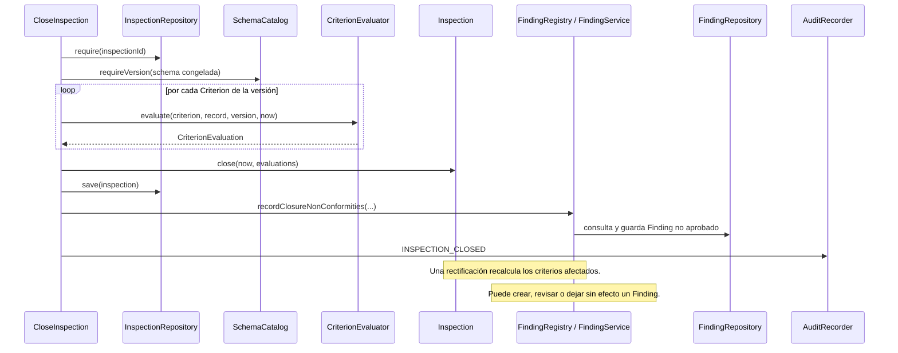
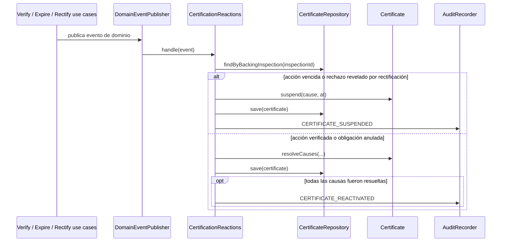

# Arquitectura actual

Este documento representa la implementación vigente. Está escrito en [Mermaid](https://mermaid.js.org/), por lo que GitHub y la vista previa de Markdown de VS Code pueden renderizar los diagramas directamente.

El proyecto sigue una arquitectura de puertos y adaptadores: los casos de uso dependen de interfaces (`port`), y las implementaciones en memoria que permiten ejercitar el sistema viven en `src/test`.

## Componentes y dependencias

```mermaid
flowchart TB
    subgraph Application["Capa de aplicación · casos de uso"]
        CatalogueUC["Catálogo<br/>RegisterParty · RegisterAsset<br/>RelocateAsset · ChangeAssetResponsible"]
        SchemaUC["Esquemas<br/>CreateSchema · OpenDraft<br/>EditDraft · PublishSchemaVersion"]
        InspectionUC["Inspecciones<br/>Assign · Start · Record<br/>Close · Rectify"]
        FindingUC["Hallazgos y acciones<br/>Plan · Report · Verify · Expire"]
        CertificationUC["Certificación<br/>Evaluate · Issue · Renew · Expire"]
        ReportsUC["Reportes<br/>GenerateInspectionAct<br/>GenerateFindingsSummary<br/>GenerateCertificateReport"]
    end

    subgraph Services["Servicios de aplicación"]
        AssetDirectory["CatalogueAssetDirectory"]
        SchemaCatalog["PublishedSchemaCatalog"]
        FindingService["FindingService<br/>(implementa FindingRegistry)"]
        ContextAssembler["CertificationContextAssembler"]
        Reactions["CertificationReactions<br/>(DomainEventHandler)"]
        Audit["AuditRecorder"]
    end

    subgraph Ports["Puertos (interfaces)"]
        AssetPorts["AssetRepository · PartyRepository<br/>AssetDirectory"]
        SchemaPorts["SchemaRepository · SchemaCatalog"]
        InspectionPorts["InspectionRepository · InspectionQuery<br/>FindingRegistry"]
        FindingPorts["FindingRepository · FindingQuery"]
        CertificatePort["CertificateRepository"]
        InfrastructurePorts["Clock · IdGenerator · ActorProvider<br/>DomainEventPublisher · AuditTrail"]
    end

    subgraph Domain["Dominio"]
        Catalogue["Catálogo<br/>Party · Asset · AssetSnapshot"]
        Schema["Esquemas<br/>InspectionSchema · SchemaDraft<br/>SchemaVersion · Criterion · EvaluationRule"]
        Inspection["Inspecciones<br/>Inspection · CriterionRecord<br/>Rectification"]
        Evaluation["Evaluación<br/>CriterionEvaluator · CriterionEvaluation"]
        Finding["Hallazgos<br/>Finding · CorrectiveAction"]
        Certificate["Certificados<br/>Certificate · CertificateIssuancePolicy"]
        AuditModel["Auditoría<br/>AuditEntry"]
        Events["Eventos de dominio<br/>CorrectiveActionClosed / Expired / Voided<br/>CriterionResultRevised"]
    end

    subgraph TestAdapters["Adaptadores de prueba (src/test)"]
        Memory["InMemoryCatalogue · InMemorySchemaRepository<br/>InMemoryInspectionRepository · InMemoryFindingRepository<br/>InMemoryCertificateRepository · InMemoryAuditTrail"]
        Runtime["TestClock · SequentialIds · FixedActor<br/>DispatchingEventPublisher"]
        Composition["FullSystem<br/>(composition root de integración)"]
    end

    CatalogueUC --> AssetPorts
    SchemaUC --> SchemaPorts
    InspectionUC --> InspectionPorts
    InspectionUC --> AssetDirectory & SchemaCatalog & FindingService
    FindingUC --> FindingPorts
    CertificationUC --> CertificatePort & ContextAssembler
    ReportsUC --> InspectionPorts & FindingPorts & CertificatePort

    AssetDirectory --> AssetPorts
    SchemaCatalog --> SchemaPorts
    FindingService --> FindingPorts & InfrastructurePorts
    ContextAssembler --> FindingPorts & CertificatePort & InfrastructurePorts
    Reactions --> CertificatePort & Audit
    Audit --> InfrastructurePorts

    CatalogueUC --> Catalogue
    SchemaUC --> Schema
    InspectionUC --> Inspection & Evaluation
    FindingUC --> Finding & Events
    CertificationUC --> Certificate
    Audit --> AuditModel

    Memory -. "implementa" .-> AssetPorts & SchemaPorts & InspectionPorts & FindingPorts & CertificatePort
    Runtime -. "implementa" .-> InfrastructurePorts
    Runtime -. "despacha" .-> Reactions
    Composition -. "ensambla" .-> Application & Services & Memory & Runtime
```



## Modelo de dominio principal

Este es el diagrama más detallado. Expone todos los atributos de estado de las entidades centrales y sus operaciones de negocio principales. Las clases auxiliares (identificadores, enums, notas, evidencias, cambios y valores de auditoría) se agrupan o se reducen para que el gráfico siga siendo utilizable.

La leyenda de color es intencional: **azul** para agregados que administran su propio ciclo de vida, **verde** para entidades de soporte, **violeta** para valores (e incluye el borrador mutable), **amarillo** para servicios/políticas y **gris** para una interfaz. El rombo negro indica composición y una flecha con la etiqueta `por id` indica una referencia almacenada como identificador, no una asociación de objetos.

```mermaid
classDiagram
    direction LR

    class InspectionSchema {
        <<aggregate root>>
        -SchemaId id
        -String name
        -Set~AssetType~ applicableAssetTypes
        -List~SchemaVersion~ publishedVersions
        -SchemaDraft draft
        +openDraft() SchemaDraft
        +publish(at) PublicationResult
        +applyTo(assetType)
        +stopApplyingTo(assetType)
    }
    class SchemaDraft {
        <<value-like mutable draft>>
        -List~Section~ sections
        +addSection(section)
        +removeSection(name)
        +declaredOutcomes() Set~RuleOutcome~
        +publicationViolations() List~String~
    }
    class SchemaVersion {
        <<value>>
        +SchemaVersionId id
        +List~Section~ sections
        +Instant publishedAt
        +criteria() List~Criterion~
    }
    class Section {
        <<value>>
        +String name
        +int order
        +List~Criterion~ criteria
    }
    class Criterion {
        <<value>>
        +CriterionId id
        +EvaluationRule rule
        +List~EvidenceRequirement~ evidenceRequirements
        +shortfalls(presented) List~EvidenceShortfall~
    }
    class EvaluationRule {
        <<interface>>
        +admissibilityViolation(answer) Optional~String~
        +evaluate(answer) RuleOutcome
        +publicationViolations() List~String~
    }
    class YesNoRule
    class NumericRangeRule
    class MappedOptionsRule

    class Asset {
        <<aggregate root>>
        -AssetId id
        -String name
        -AssetType assetType
        -Map~StringToString~ characteristics
        -ResponsiblePartyRef responsible
        -String location
        +assignResponsible(ref) FieldChange
        +relocate(location) FieldChange
        +captureSnapshot(at) AssetSnapshot
    }
    class Party {
        <<entity>>
        -PartyId id
        -String name
        -PartyKind kind
        +reference() ResponsiblePartyRef
    }
    class AssetSnapshot {
        <<value>>
        +AssetId assetId
        +AssetType assetType
        +String name
        +Map~StringToString~ characteristics
        +String location
        +ResponsiblePartyRef responsible
        +Instant capturedAt
    }

    class Inspection {
        <<aggregate root>>
        -InspectionId id
        -AssetId assetId
        -PartyId inspector
        -LocalDate expectedDate
        -InspectionStatus status
        -SchemaVersionId frozenSchemaVersionId
        -AssetSnapshot assetSnapshot
        -Instant startedAt
        -Instant closedAt
        -Map~CriterionIdToCriterionRecord~ records
        -List~InspectionNote~ notes
        -List~Rectification~ rectifications
        +start(version, snapshot, at)
        +close(at, evaluations) InspectionClosureResult
        +rectify(id, author, at, reason, corrections) Rectification
        +recordEvaluationProducedBy(criterion, evaluation)
    }
    class CriterionRecord {
        <<entity>>
        -CriterionId criterionId
        -Answer answer
        -List~EvidenceRecord~ evidence
        -List~CriterionEvaluation~ evaluations
        +recordAnswer(answer)
        +attach(evidence)
        +recordClosureEvaluation(evaluation)
        +appendRectifiedEvaluation(evaluation)
    }
    class CriterionEvaluation {
        <<value>>
        +CriterionResult result
        +List~EvaluationReason~ reasons
        +Severity severity
        +Instant evaluatedAt
        +Optional~RectificationId~ rectificationId
    }
    class Rectification {
        <<value>>
        +RectificationId id
        +PartyId author
        +Instant performedAt
        +String reason
        +List~RectificationChange~ changes
        +affectedCriteria() Set~CriterionId~
    }
    class CriterionEvaluator {
        <<domain service>>
        +evaluate(criterion, record, version, at) CriterionEvaluation
    }

    class Finding {
        <<aggregate root>>
        -FindingId id
        -InspectionId inspectionId
        -CriterionId criterionId
        -AssetId assetId
        -PartyId responsible
        -Instant createdAt
        -CriterionResult result
        -List~EvaluationReason~ reasons
        -Severity severity
        -List~String~ presentedEvidence
        -CorrectiveAction correctiveAction
        -List~FindingRevision~ revisions
        -VoidedObligation voided
        +revise(...)
        +voidObligation(...)
        +blocksCertification() boolean
    }
    class CorrectiveAction {
        <<entity>>
        -CorrectiveActionId id
        -CorrectiveActionStatus status
        -CorrectionPlan plan
        -List~ExecutionReport~ executions
        -List~Verification~ verifications
        -Instant closedAt
        -boolean deadlineBreached
        -VoidedObligation voided
        +confirmPlan(plan)
        +reportExecution(report)
        +verify(verification, today) boolean
        +expireIfOverdue(today) boolean
        +voidObligation(record)
    }

    class Certificate {
        <<aggregate root>>
        -CertificateId id
        -AssetId assetId
        -InspectionId backingInspectionId
        -SchemaVersionId schemaVersionId
        -ValidityPeriod validity
        -CertificateId previousCertificateId
        -List~SuspensionRecord~ suspensions
        -CertificateStatus status
        +suspend(cause, at) boolean
        +resolveCauses(matches, how, at) boolean
        +expireIfDue(at) boolean
    }
    class CertificateIssuancePolicy {
        <<domain policy>>
        -List~IssuanceRequirement~ requirements
        +blockersFor(context) List~IssuanceBlocker~
    }

    InspectionSchema *-- "0..1" SchemaDraft
    InspectionSchema *-- "0..*" SchemaVersion
    SchemaVersion *-- "1..*" Section
    Section *-- "0..*" Criterion
    Criterion *-- "0..*" EvidenceRequirement
    Criterion --> EvaluationRule
    EvaluationRule <|.. YesNoRule
    EvaluationRule <|.. NumericRangeRule
    EvaluationRule <|.. MappedOptionsRule

    Asset --> Party : responsable por id
    Inspection --> Asset : assetId
    Inspection --> SchemaVersion : versión congelada por id
    Inspection *-- "1..*" CriterionRecord
    Inspection *-- "0..*" InspectionNote
    Inspection *-- "0..*" Rectification
    Inspection *-- "0..1" AssetSnapshot
    CriterionRecord *-- "0..*" EvidenceRecord
    CriterionRecord *-- "0..*" CriterionEvaluation
    CriterionEvaluator ..> Criterion
    CriterionEvaluator ..> CriterionRecord

    Finding --> Inspection : inspectionId
    Finding --> Criterion : criterionId
    Finding *-- CorrectiveAction
    Certificate --> Asset : assetId
    Certificate --> Inspection : respaldo por id
    Certificate --> SchemaVersion : schemaVersionId
    CertificateIssuancePolicy ..> Finding : bloqueos vía contexto

    classDef aggregate fill:#dbeafe,stroke:#2563eb,color:#172554,stroke-width:2px
    classDef entity fill:#dcfce7,stroke:#16a34a,color:#14532d
    classDef value fill:#f3e8ff,stroke:#9333ea,color:#581c87
    classDef service fill:#fef3c7,stroke:#d97706,color:#78350f
    classDef contract fill:#e5e7eb,stroke:#4b5563,color:#111827,stroke-dasharray: 5 5
    class InspectionSchema,Asset,Inspection,Finding,Certificate aggregate
    class Party,CriterionRecord,CorrectiveAction entity
    class SchemaDraft,SchemaVersion,Section,Criterion,AssetSnapshot,CriterionEvaluation,Rectification value
    class CriterionEvaluator,CertificateIssuancePolicy service
    class EvaluationRule contract
```

## Recorrido: cierre y rectificación de una inspección



## Recorrido: eventos que afectan certificados



## Lectura rápida

- `FullSystem` es el punto de composición que se usa en las pruebas de integración; no hay, por ahora, adaptadores de producción ni un punto de entrada web/CLI.
- `Inspection` conserva una versión congelada del esquema al iniciarse. De ese modo, una inspección se evalúa contra el esquema que estaba vigente en ese momento.
- `FindingService` conecta el cierre o la rectificación con los hallazgos y sus acciones correctivas.
- `CertificationContextAssembler` reúne el estado de inspección, hallazgos y certificados; `CertificateIssuancePolicy` decide si existen bloqueos para emitir o renovar.
- La auditoría es transversal a los casos de uso y `CertificationReactions` reacciona a eventos para suspender o reactivar certificados.
