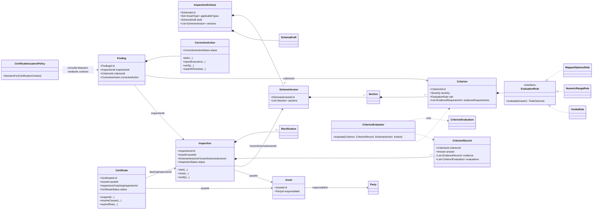
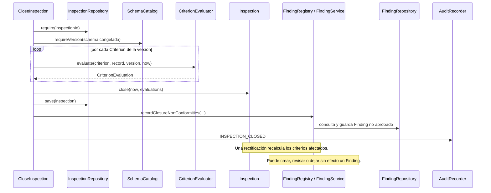
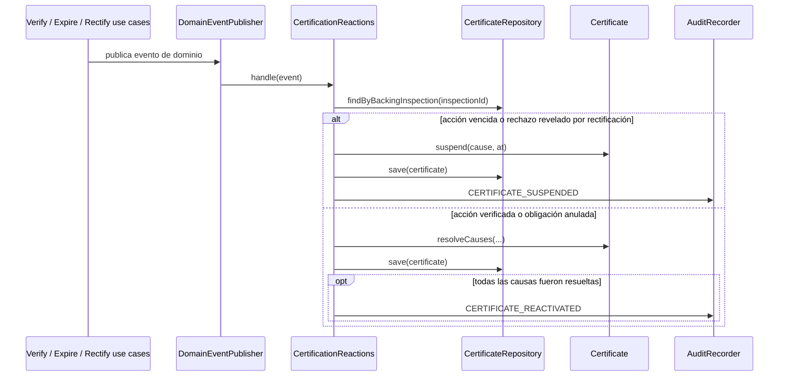

# Arquitectura actual

Este documento representa la implementación vigente. Está escrito en [Mermaid](https://mermaid.js.org/), por lo que GitHub y la vista previa de Markdown de VS Code pueden renderizar los diagramas directamente.

El proyecto sigue una arquitectura de puertos y adaptadores: los casos de uso dependen de interfaces (`port`), y las implementaciones en memoria que permiten ejercitar el sistema viven en `src/test`.

## Componentes y dependencias

```mermaid
flowchart TB
    subgraph Application["Capa de aplicación · casos de uso"]
        CatalogueUC["Catálogo<br/>RegisterParty · RegisterAsset<br/>RelocateAsset · ChangeAssetResponsible"]
        SchemaUC["Esquemas<br/>CreateSchema · OpenDraft<br/>EditDraft · PublishSchemaVersion"]
        InspectionUC["Inspecciones<br/>Assign · Start · Record<br/>Close · Rectify"]
        FindingUC["Hallazgos y acciones<br/>Plan · Report · Verify · Expire"]
        CertificationUC["Certificación<br/>Evaluate · Issue · Renew · Expire"]
        ReportsUC["Reportes<br/>GenerateInspectionAct<br/>GenerateFindingsSummary<br/>GenerateCertificateReport"]
    end

    subgraph Services["Servicios de aplicación"]
        AssetDirectory["CatalogueAssetDirectory"]
        SchemaCatalog["PublishedSchemaCatalog"]
        FindingService["FindingService<br/>(implementa FindingRegistry)"]
        ContextAssembler["CertificationContextAssembler"]
        Reactions["CertificationReactions<br/>(DomainEventHandler)"]
        Audit["AuditRecorder"]
    end

    subgraph Ports["Puertos (interfaces)"]
        AssetPorts["AssetRepository · PartyRepository<br/>AssetDirectory"]
        SchemaPorts["SchemaRepository · SchemaCatalog"]
        InspectionPorts["InspectionRepository · InspectionQuery<br/>FindingRegistry"]
        FindingPorts["FindingRepository · FindingQuery"]
        CertificatePort["CertificateRepository"]
        InfrastructurePorts["Clock · IdGenerator · ActorProvider<br/>DomainEventPublisher · AuditTrail"]
    end

    subgraph Domain["Dominio"]
        Catalogue["Catálogo<br/>Party · Asset · AssetSnapshot"]
        Schema["Esquemas<br/>InspectionSchema · SchemaDraft<br/>SchemaVersion · Criterion · EvaluationRule"]
        Inspection["Inspecciones<br/>Inspection · CriterionRecord<br/>Rectification"]
        Evaluation["Evaluación<br/>CriterionEvaluator · CriterionEvaluation"]
        Finding["Hallazgos<br/>Finding · CorrectiveAction"]
        Certificate["Certificados<br/>Certificate · CertificateIssuancePolicy"]
        AuditModel["Auditoría<br/>AuditEntry"]
        Events["Eventos de dominio<br/>CorrectiveActionClosed / Expired / Voided<br/>CriterionResultRevised"]
    end

    subgraph TestAdapters["Adaptadores de prueba (src/test)"]
        Memory["InMemoryCatalogue · InMemorySchemaRepository<br/>InMemoryInspectionRepository · InMemoryFindingRepository<br/>InMemoryCertificateRepository · InMemoryAuditTrail"]
        Runtime["TestClock · SequentialIds · FixedActor<br/>DispatchingEventPublisher"]
        Composition["FullSystem<br/>(composition root de integración)"]
    end

    CatalogueUC --> AssetPorts
    SchemaUC --> SchemaPorts
    InspectionUC --> InspectionPorts
    InspectionUC --> AssetDirectory & SchemaCatalog & FindingService
    FindingUC --> FindingPorts
    CertificationUC --> CertificatePort & ContextAssembler
    ReportsUC --> InspectionPorts & FindingPorts & CertificatePort

    AssetDirectory --> AssetPorts
    SchemaCatalog --> SchemaPorts
    FindingService --> FindingPorts & InfrastructurePorts
    ContextAssembler --> FindingPorts & CertificatePort & InfrastructurePorts
    Reactions --> CertificatePort & Audit
    Audit --> InfrastructurePorts

    CatalogueUC --> Catalogue
    SchemaUC --> Schema
    InspectionUC --> Inspection & Evaluation
    FindingUC --> Finding & Events
    CertificationUC --> Certificate
    Audit --> AuditModel

    Memory -. "implementa" .-> AssetPorts & SchemaPorts & InspectionPorts & FindingPorts & CertificatePort
    Runtime -. "implementa" .-> InfrastructurePorts
    Runtime -. "despacha" .-> Reactions
    Composition -. "ensambla" .-> Application & Services & Memory & Runtime
```

## Modelo de dominio principal

Las flechas con rombo indican composición: la entidad de origen administra el ciclo de vida de la entidad o valor de destino. Las relaciones etiquetadas `id` son referencias por identificador, no una asociación de objetos en memoria.

## Recorrido: cierre y rectificación de una inspección

## Recorrido: eventos que afectan certificados

## Lectura rápida

- `FullSystem` es el punto de composición que se usa en las pruebas de integración; no hay, por ahora, adaptadores de producción ni un punto de entrada web/CLI.
- `Inspection` conserva una versión congelada del esquema al iniciarse. De ese modo, una inspección se evalúa contra el esquema que estaba vigente en ese momento.
- `FindingService` conecta el cierre o la rectificación con los hallazgos y sus acciones correctivas.
- `CertificationContextAssembler` reúne el estado de inspección, hallazgos y certificados; `CertificateIssuancePolicy` decide si existen bloqueos para emitir o renovar.
- La auditoría es transversal a los casos de uso y `CertificationReactions` reacciona a eventos para suspender o reactivar certificados.
